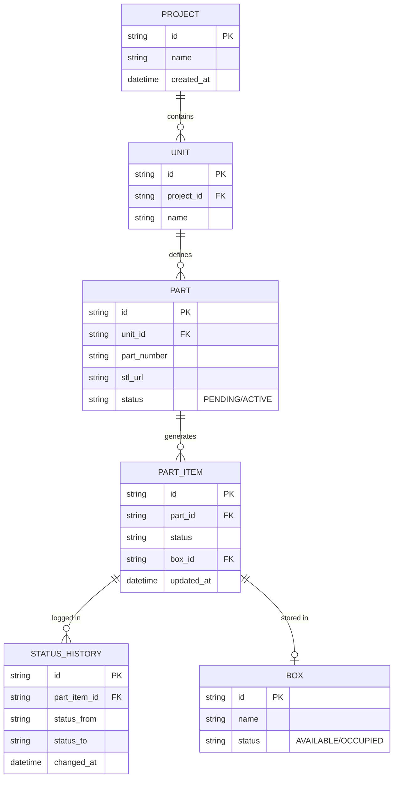

# データモデル定義書 (Draft)

## 1. エンティティ関係図 (ERD)

## 2. テーブル詳細

### 2.1 Part (部品マスタ)
設計データの基本単位。
- `id`: 内部ID
- `part_number`: 型番・図番
- `stl_url`: Firebase Storage上のパス
- `status`: インポート進捗状態
    - `PENDING`: DB登録済み、ファイルアップロード待ち
    - `ACTIVE`: ファイルアップロード完了、利用可能

### 2.2 PartItem (個体データ)
製造現場で実際に動く「モノ」の単位。
- `id`: シリアルID
- `status`: 現在の工程（例: 待機、製造中、検査済、出荷済）
- `box_id`: 物理的な棚や箱のID

### 2.3 StatusHistory (履歴)
トレーサビリティのための変更ログ。
- `part_item_id`: 対象個体
- `status_from / status_to`: 遷移前後
- `changed_at`: 変更日時

### 2.4 Box (保管場所)
- `name`: 場所名（棚A-1等）
- `status`: 空き状況の管理
